# 简易跨境电商商品与仓储管理系统

基于本地mySql数据库的简易管理系统，QT完成图形化界面操作 实现订单管理，货品管理，仓库出入管理，仓库信息统计，供应商管理，客户管理等模块

## 系统设计与实现

用户登陆功能：使用内置的用户表进行用户名和密码的比对，控制系统的登录
 
### 登陆界面

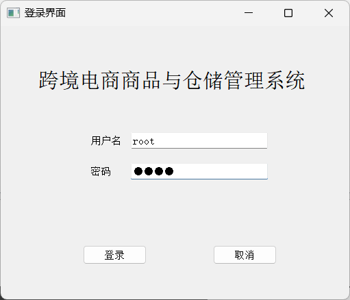

### 货品管理页

展示所有货品的基本信息，以及详尽的统计信息，如库存量，平均入库价格，平均出库价格，还有所属的供应商公司信息

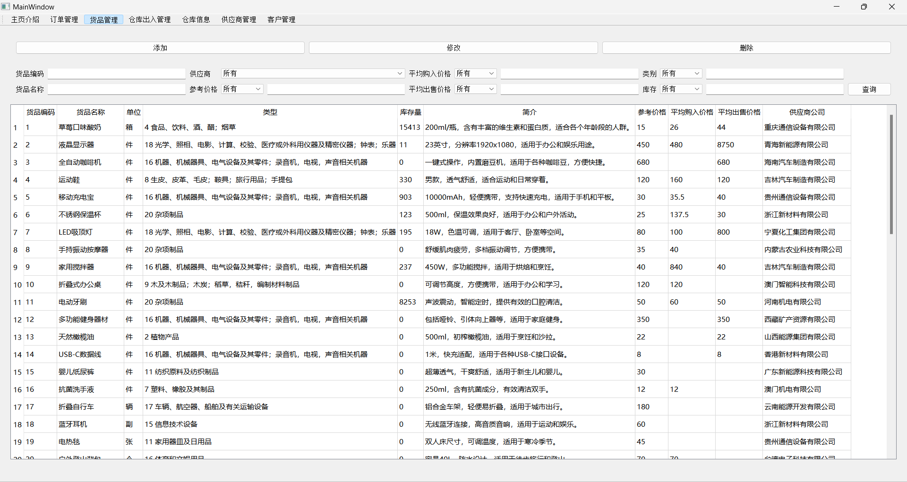

通过在mysql中创建视图，来方便的在GUI中展示数据，创建视图的代码如下
 
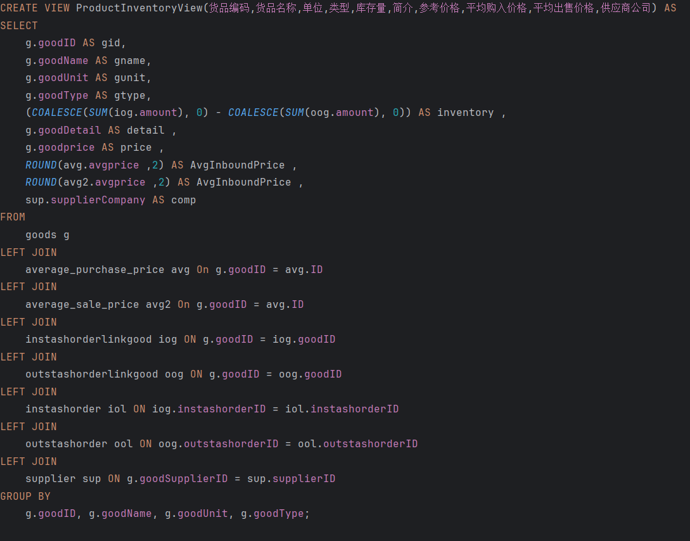

### 查询功能

的实现是通过在后端编写SQL语句，执行并查询

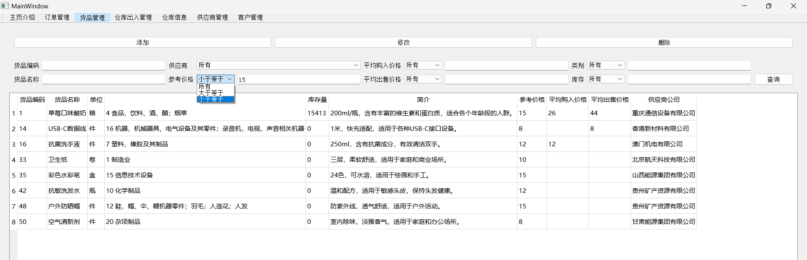

### 增加商品界面

使用了下拉列表，既实现了操作便携，也保证了数据添加的一致性
 

 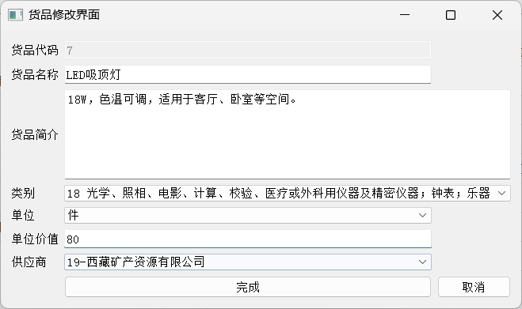

### 入库单和出库单的查看页面

展示了入库单出库单的创建人等基本信息，还包括了总金额和出入库数量等统计信息
 

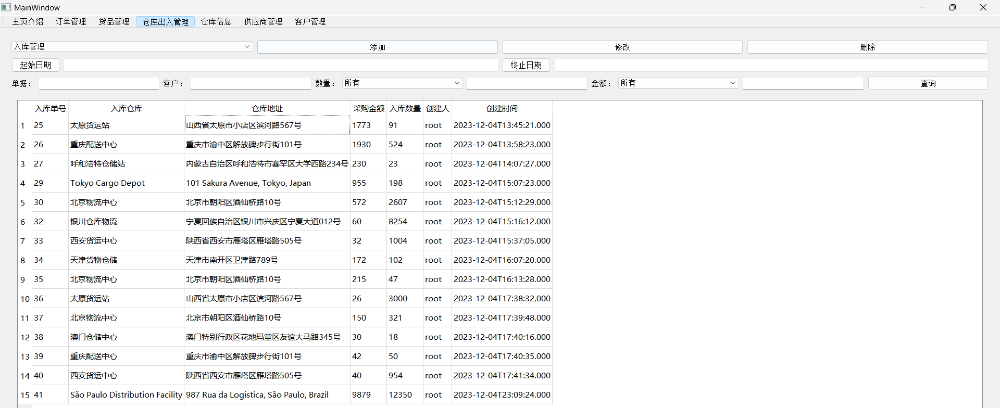

### 入库单的添加界面

实现了一个可添加的商品列表
 
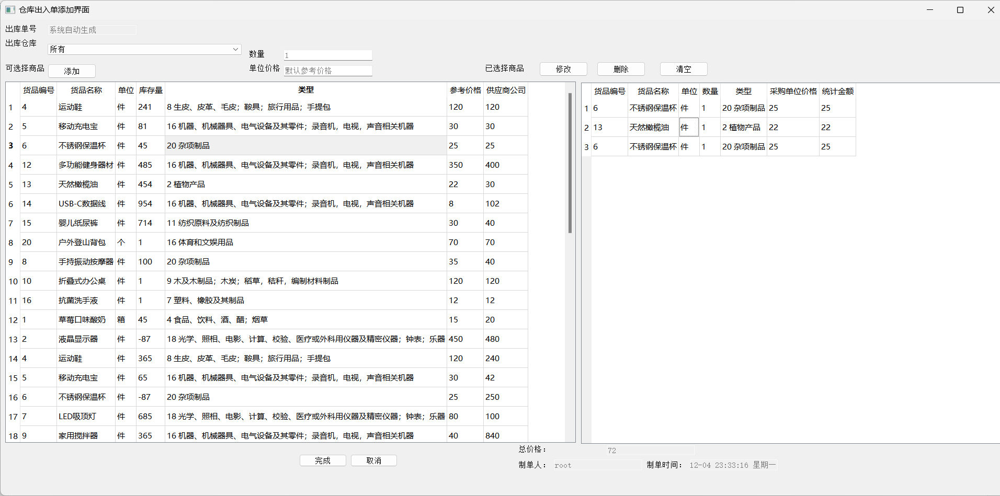

同时实时显示了已经添加商品的总价格，还有创建入库单所必要的不可修改信息的显示

### 出库单添加界面

实现了只展示有存库的仓库，并可以通过下拉菜单获得一个仓库的所有可用商品

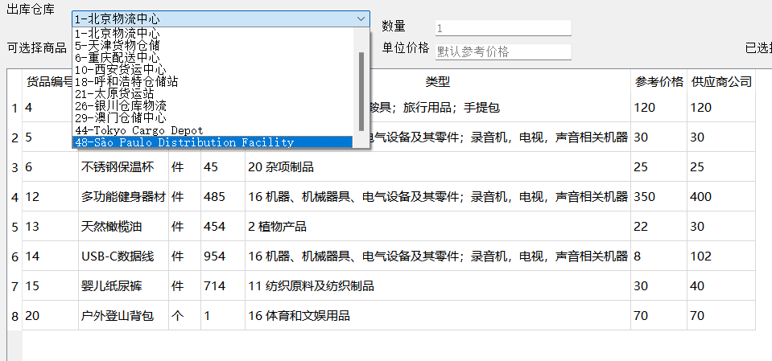
 
### 触发器的使用

关于入库单和附属货品单的删除，通过触发器来实现连带删除功能：

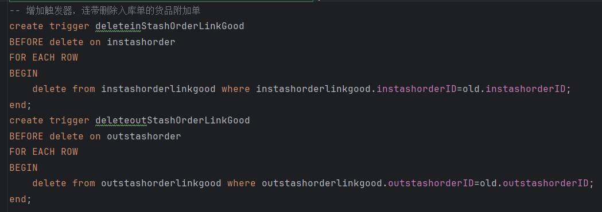

### 仓库信息界面

是一个对仓库内存储的货品的总览，展示了库存和平均出入库价格等信息
同时还能通过下拉菜单进行方便的单个仓库查看
 
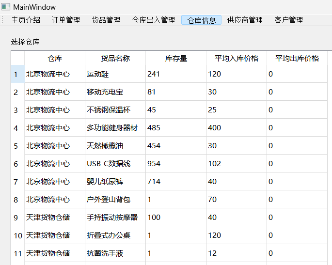

### 客户管理和供应商管理界面

在展示信息的同时，提供了方便的查询菜单

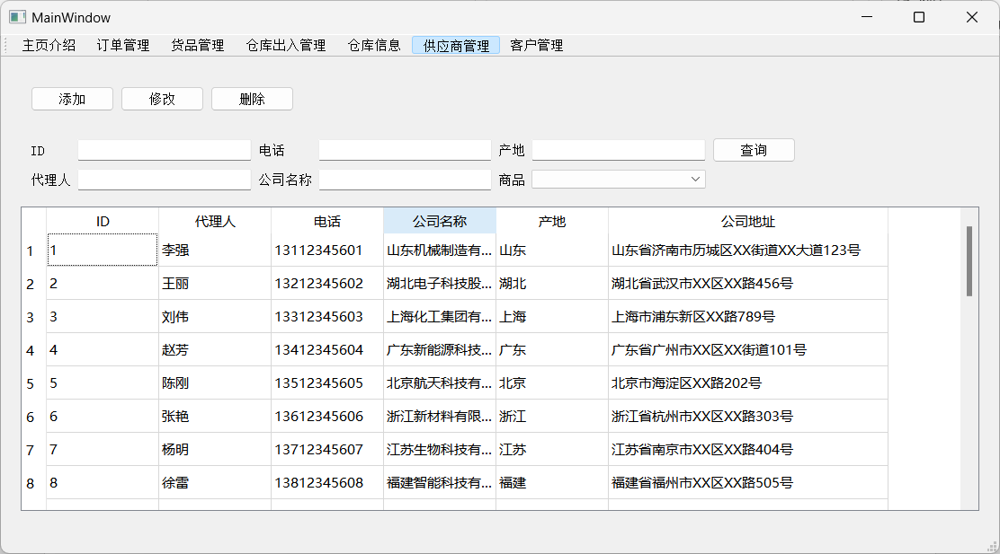

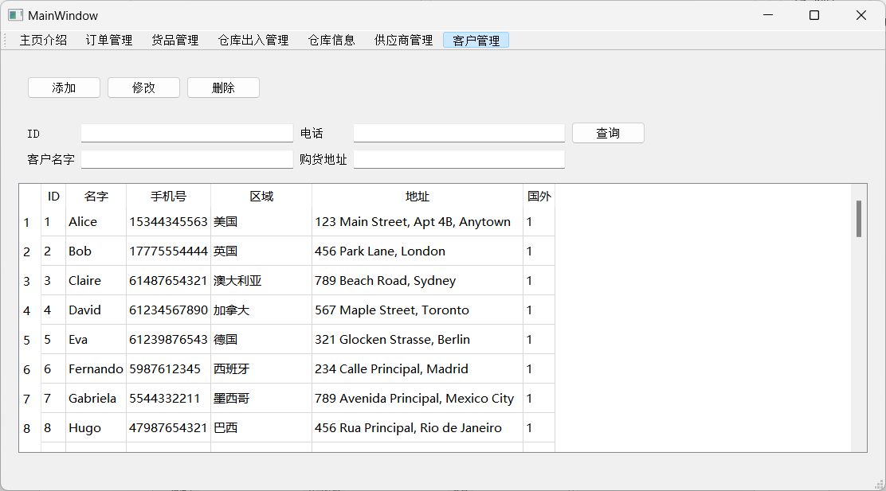
 
对客户和供应商的增删改均进行了实现：

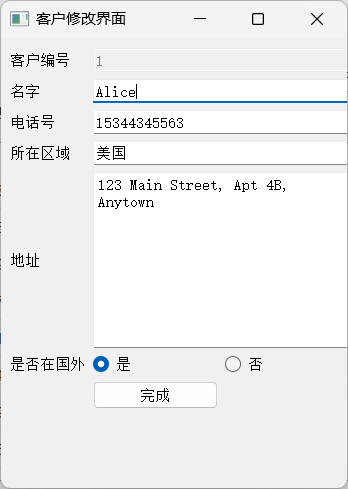

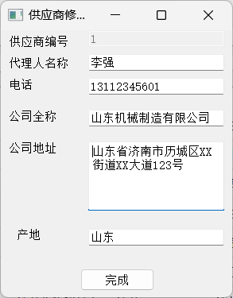
   
### 结论
MySQL 作为关系型数据库管理系统，使用表格和SQL语言进行数据管理，使得繁杂的数据操作变得清晰有条理，并且内部使用高效性能的数据结构，使得mysql在我的软件中性能优越，且让我不必多虑数据在磁盘中的存储，省心省事，提高了软件开发的效率。
同时MySQL中创建视图，创建触发器的功能都能大大简化软件对数据库的访问操作和修改操作，比如我在软件中使用了触发器实现了连带删除的功能，可以保证在删除主记录时，其他将它作为外键的记录能被提前删除，保证了数据的完整性。
